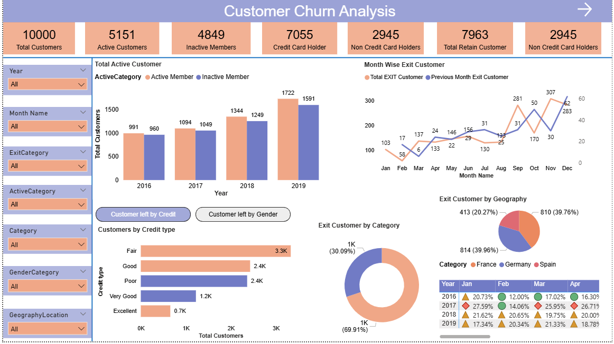
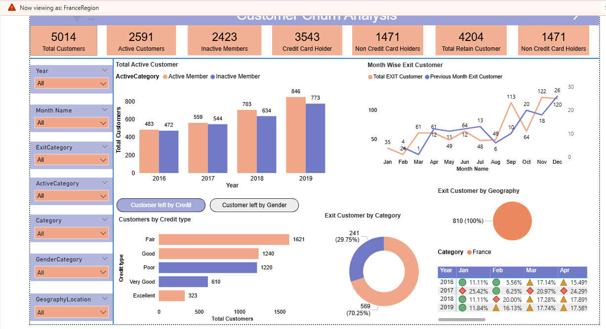

# 📊 Customer Churn Analysis – Power BI Project

This repository contains the complete Power BI solution for **Customer Churn Analysis**, built using professional BI development practices.  
The dashboard provides a clean, interactive, and insightful view of customer behavior, churn patterns, demographics, and credit risk categories.  
It showcases DAX calculations, data modeling, transformation pipelines, and enterprise-ready Power BI features such as RLS, gateways, bookmarks, and scheduled refresh.

  
  
  

---

## 🔄 Project Flow Steps

1) Business Requirement Document  
2) Functional Requirement Document  
3) Data Gathering  
4) Data Cleaning / Transformation  
5) Data Modeling  
6) UI (Power BI Reports)  
7) DAX Measures  
8) Enhance UI  
9) Row Level Security (RLS)  
10) Create Workspace  
11) Publish Report to Workspace  
12) Gateway Setup (one-time)  
13) Schedule Refresh  
14) Add Security Roles  
15) Subscriptions & Alerts  
16) Share Reports  

---

## 📝 Business Requirement Details

CustomerID – unique identifier  
Surname – not relevant for churn  
CreditScore – strongly affects churn  
    Excellent: 800–850  
    Very Good: 740–799  
    Good: 670–739  
    Fair: 580–669  
    Poor: 300–579  

Geography – churn varies by location  
Gender – to analyze churn patterns  
Age – younger customers churn more  
Tenure – more tenure → lower churn  
Balance – higher balance → lower churn  
NumOfProducts – bank engagement level  
HasCrCard – 1 holder, 0 non-holder  
IsActiveMember – active customers churn less  
EstimatedSalary – lower salary → higher churn  
Exited – 1 Exit, 0 Retain  
Bank DOJ – joining date  

---
---

## 🚀 Features

- Interactive Customer Churn Dashboard  
- Year-wise active vs inactive customer trend  
- Monthly churn trend and previous month comparison  
- Churn breakdown by geography, gender, age & credit score  
- Credit score classification using calculated columns  
- DAX measures for churn %, active customers, exit counts, etc.  
- Date table generated using CALENDAR()  
- Page navigation using bookmarks  
- Row Level Security (RLS) implementation  
- Scheduled refresh & gateway configuration  
- Clean UI with slicers, filters, cards, charts and trends  

---

## 📁 Data Sources

- Bank_Churn  
- CreditCard  
- ActiveCustomer  
- ExitCustomer  
- CustomerInfo  
- Gender  
- Geography  
- DateMaster (calculated table)

---

## 🧮 DAX Measures (Copy–Paste Ready)

Active Customers =
CALCULATE(
    COUNT(Bank_Churn[CustomerId]),
    ActiveCustomer[ActiveCategory] = "Active Member"
)

Churn % =
VAR EC = 'Calculations'[Total EXIT Customer]
VAR TC = 'Calculations'[Total Customers]
RETURN DIVIDE(EC, TC)

Credit Card Holder =
CALCULATE(
    COUNT(Bank_Churn[CustomerId]),
    CreditCard[Category] = "credit card holder"
)

Inactive Members =
[Total Customers] - [Active Customers]

Non Credit Card Holders =
CALCULATE(
    COUNT(Bank_Churn[CustomerId]),
    CreditCard[Category] = "non credit card holder"
)

Previous Month Exit Customer =
CALCULATE(
    'Calculations'[Total EXIT Customer],
    PREVIOUSMONTH(DateMaster[Date])
)

Total Customers =
CALCULATE(DISTINCTCOUNT(Bank_Churn[CustomerId]))

Total EXIT Customer =
CALCULATE(
    COUNT(Bank_Churn[CustomerId]),
    ExitCustomer[ExitCategory] = "Exit"
)

Total Female =
CALCULATE(
    COUNT(Bank_Churn[CustomerId]),
    Gender[GenderCategory] = "Female"
)

Total Male =
CALCULATE(
    COUNT(Bank_Churn[CustomerId]),
    Gender[GenderCategory] = "Male"
)

Total Retain Customer =
CALCULATE(
    COUNT(Bank_Churn[CustomerId]),
    ExitCustomer[ExitCategory] = "Retain"
)

---

## 📅 New Table

DateMaster =
CALENDAR(
    FIRSTDATE(Bank_Churn[Bank DOJ]),
    LASTDATE(Bank_Churn[Bank DOJ])
)

---

## 🧱 Calculated Column

Credit type =
SWITCH(
    TRUE(),
    Bank_Churn[CreditScore] >= 800 && Bank_Churn[CreditScore] <= 850, "Excellent",
    Bank_Churn[CreditScore] >= 740 && Bank_Churn[CreditScore] <= 799, "Very Good",
    Bank_Churn[CreditScore] >= 670 && Bank_Churn[CreditScore] <= 739, "Good",
    Bank_Churn[CreditScore] >= 580 && Bank_Churn[CreditScore] <= 669, "Fair",
    Bank_Churn[CreditScore] >= 300 && Bank_Churn[CreditScore] <= 579, "Poor"
)

## 🎓 Concepts Learned

- Business Logic & KPI Creation  
- DAX Measures  
- Bookmark Navigation  
- Page Navigation (Ctrl + select required)  
- Q&A Visual for AI-powered insights  
- Smart Narrative  
- Row Level Security  
- Data Refresh (manual + scheduled)  

Refresh Rules:  
- Pro: 8 refreshes/day  
- Premium: 48 refreshes/day  
- Gateway required if source is local  
- Cloud sources (SharePoint, SQL Azure) need no gateway  

DirectQuery: refresh every minute for live dashboards.

---

## 📦 Final Deliverables

- Power BI Dashboard (.pbix)  
- Data Model  
- DAX Calculations  
- BRD + FRD  
- Screenshots (optional)  

---

